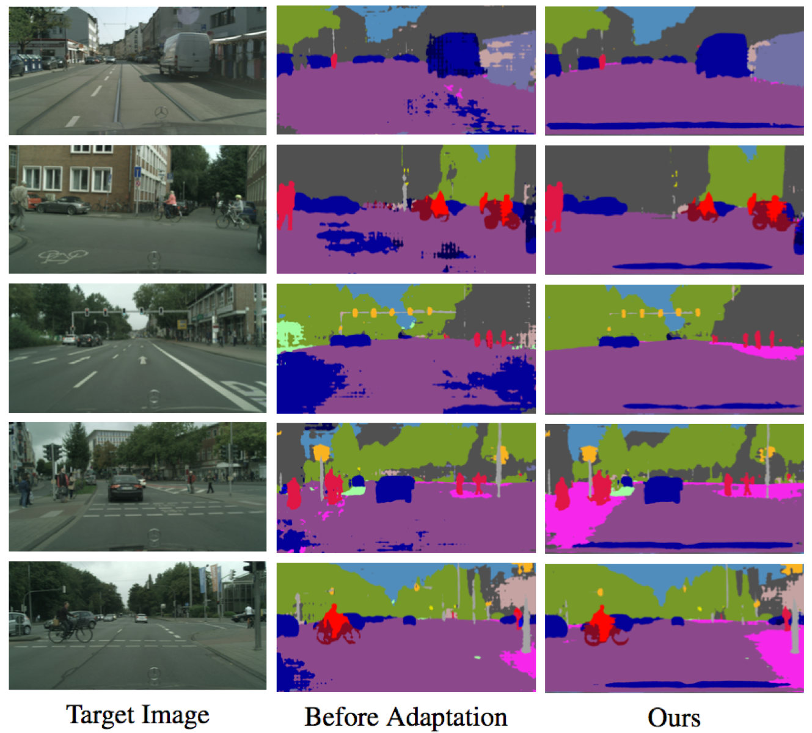

# Learning to Adapt Structured Output Space for Semantic Segmentation

Pytorch implementation of our method for adapting semantic segmentation from the synthetic dataset (source domain) to the real dataset (target domain).

Contact: Yi-Hsuan Tsai (wasidennis at gmail dot com) and Wei-Chih Hung (whung8 at ucmerced dot edu)

## Paper
Learning to Adapt Structured Output Space for Semantic Segmentation <br />
[Yi-Hsuan Tsai](https://sites.google.com/site/yihsuantsai/home)\*, [Wei-Chih Hung](https://hfslyc.github.io/)\*, [Samuel Schulter](https://samschulter.github.io/), [Kihyuk Sohn](https://sites.google.com/site/kihyuksml/), [Ming-Hsuan Yang](http://faculty.ucmerced.edu/mhyang/index.html) and [Manmohan Chandraker](http://cseweb.ucsd.edu/~mkchandraker/) <br />
IEEE Conference on Computer Vision and Pattern Recognition (CVPR), 2018 (\* indicates equal contribution).

Please cite our paper if you find it useful for your research.

```
@article{Tsai_adaptseg_2018,
  author = {Y.-H. Tsai and W.-C. Hung and S. Schulter and K. Sohn and M.-H. Yang and M. Chandraker},
  journal = {arXiv preprint arXiv:xxxx.xxxxx},
  title = {Learning to Adapt Structured Output Space for Semantic Segmentation},
  year = {2018}
}
```

## Example Results



## Quantitative Reuslts


## Installation
* Install PyTorch from http://pytorch.org

* Clone this repo
```
git clone https://github.com/wasidennis/AdaptSegNet
cd AdaptSegNet
```
## Dataset
* Download the [GTA5 Dataset](https://download.visinf.tu-darmstadt.de/data/from_games/) as the source domain, and put it in the `data/GTA5` folder

* Download the [Cityscapes Dataset](https://www.cityscapes-dataset.com/) as the target domain, and put it in the `data/Cityscapes` folder

## Testing
* Download the pre-trained [GTA5-to-Cityscapes model](http://vllab.ucmerced.edu/ytsai/CVPR18/GTA2Cityscapes_multi.pth) and put it in the `model` folder

* Test the model and results will be saved in the `result` folder

```
python evaluate_cityscapes.py --restore-from ./model/GTA2Cityscapes_multi.py
```

* Compute the IoU on Cityscapes (thanks to the code from [VisDA Challenge](http://ai.bu.edu/visda-2017/))
```
python compute_iou.py ./data/Cityscapes/data/gtFine/val result/cityscapes
```

## Training
* Download the [initial weight](http://vllab.ucmerced.edu/ytsai/CVPR18/DeepLab_resnet_pretrained_init.pth) and put it in the `model` folder

* Train the GTA5-to-Cityscapes model

```
python train_gta2cityscapes_multi.py --snapshot-dir ./snapshots/GTA2Cityscapes_multi \
                                     --lambda-seg 0.1 \
                                     --lambda-adv-target1 0.0002 --lambda-adv-target2 0.001
```

## Acknowledgment
This code is heavily borrowed from [Pytorch-Deeplab](https://github.com/speedinghzl/Pytorch-Deeplab).

## Note
The model and code are available for non-commercial research purposes only.
* 02/2018: code released


