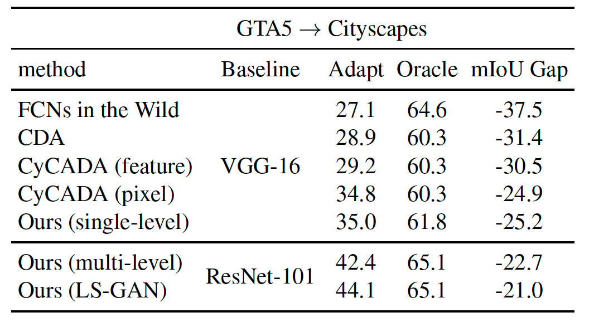

# Learning to Adapt Structured Output Space for Semantic Segmentation

Pytorch implementation of our method for adapting semantic segmentation from the synthetic dataset (source domain) to the real dataset (target domain). Based on this implementation, our result is ranked 3rd in the [VisDA Challenge](http://ai.bu.edu/visda-2017/).

Contact: Yi-Hsuan Tsai (wasidennis at gmail dot com) and Wei-Chih Hung (whung8 at ucmerced dot edu)

## Paper
[Learning to Adapt Structured Output Space for Semantic Segmentation](https://arxiv.org/abs/1802.10349) <br />
[Yi-Hsuan Tsai](https://sites.google.com/site/yihsuantsai/home)\*, [Wei-Chih Hung](https://hfslyc.github.io/)\*, [Samuel Schulter](https://samschulter.github.io/), [Kihyuk Sohn](https://sites.google.com/site/kihyuksml/), [Ming-Hsuan Yang](http://faculty.ucmerced.edu/mhyang/index.html) and [Manmohan Chandraker](http://cseweb.ucsd.edu/~mkchandraker/) <br />
IEEE Conference on Computer Vision and Pattern Recognition (CVPR), 2018 (**spotlight**) (\* indicates equal contribution).

Please cite our paper if you find it useful for your research.

```
@inproceedings{Tsai_adaptseg_2018,
  author = {Y.-H. Tsai and W.-C. Hung and S. Schulter and K. Sohn and M.-H. Yang and M. Chandraker},
  booktitle = {IEEE Conference on Computer Vision and Pattern Recognition (CVPR)},
  title = {Learning to Adapt Structured Output Space for Semantic Segmentation},
  year = {2018}
}
```

## Example Results


## Quantitative Reuslts



## Installation
* Install PyTorch from http://pytorch.org with Python 2 and CUDA 8.0

* **NEW** Add the LS-GAN objective to improve the performance
  - Usage: add `--gan LS` option during training (see below for more details)

* PyTorch 0.4 with Python 3 and CUDA 8.0
  - Usage: replace the training and evaluation codes with the ones in the `pytorch_0.4` folder
  - Update: tensorboard is provided by adding `--tensorboard` in the command
  - Note: the single-level model works as expected, while the multi-level model requires smaller weights, e.g., `--lambda-adv-target1 0.00005 --lambda-adv-target2 0.0005`. We will investigate this issue soon.

* Clone this repo
```
git clone https://github.com/wasidennis/AdaptSegNet
cd AdaptSegNet
```
## Dataset
* Download the [GTA5 Dataset](https://download.visinf.tu-darmstadt.de/data/from_games/) as the source domain, and put it in the `data/GTA5` folder

* Download the [Cityscapes Dataset](https://www.cityscapes-dataset.com/) as the target domain, and put it in the `data/Cityscapes` folder

## Pre-trained Models
* Please find our-pretrained models on three benchmark settings [here](https://www.dropbox.com/s/gpzm15ipyt01mis/DA_Seg_models.zip?dl=0)

* They include baselines (without adaptation and with feature adaptation) and our models (single-level and multi-level)

## Testing
* **NEW** Update results using LS-GAN and using [Synscapes](https://7dlabs.com/synscapes-overview) as the source domain
  - Performance: check the appendix of the updated [arXiv paper](https://arxiv.org/abs/1802.10349) (updated on 10/17/2019)
  - [Pre-trained models](https://www.dropbox.com/s/sif9cd6ad4s9y5d/AdaptSegNet_LSGAN_models.zip?dl=0)

* Download the pre-trained multi-level [GTA5-to-Cityscapes model](http://vllab.ucmerced.edu/ytsai/CVPR18/GTA2Cityscapes_multi-ed35151c.pth) and put it in the `model` folder

* Test the model and results will be saved in the `result` folder

```
python evaluate_cityscapes.py --restore-from ./model/GTA2Cityscapes_multi-ed35151c.pth
```

* Or, test the VGG-16 based model [Model Link](http://vllab.ucmerced.edu/ytsai/CVPR18/GTA2Cityscapes_vgg-ac4ac9f6.pth)

```
python evaluate_cityscapes.py --model DeeplabVGG --restore-from ./model/GTA2Cityscapes_vgg-ac4ac9f6.pth
```

* Compute the IoU on Cityscapes (thanks to the code from [VisDA Challenge](http://ai.bu.edu/visda-2017/))
```
python compute_iou.py ./data/Cityscapes/data/gtFine/val result/cityscapes
```

## Training Examples
* **NEW** Train the GTA5-to-Cityscapes model (single-level with LS-GAN)

```
python train_gta2cityscapes_multi.py --snapshot-dir ./snapshots/GTA2Cityscapes_single_lsgan \
                                     --lambda-seg 0.0 \
                                     --lambda-adv-target1 0.0 --lambda-adv-target2 0.01 \
                                     --gan LS
```

* Train the GTA5-to-Cityscapes model (multi-level)

```
python train_gta2cityscapes_multi.py --snapshot-dir ./snapshots/GTA2Cityscapes_multi \
                                     --lambda-seg 0.1 \
                                     --lambda-adv-target1 0.0002 --lambda-adv-target2 0.001
```

* Train the GTA5-to-Cityscapes model (single-level)

```
python train_gta2cityscapes_multi.py --snapshot-dir ./snapshots/GTA2Cityscapes_single \
                                     --lambda-seg 0.0 \
                                     --lambda-adv-target1 0.0 --lambda-adv-target2 0.001
```

## Related Implementation and Dataset
* Y.-H. Tsai, K. Sohn, S. Schulter, and M. Chandraker. Domain Adaptation for Structured Output via Discriminative Patch Representations. In ICCV, 2019. (Oral) [[paper]](https://arxiv.org/abs/1901.05427v3) [[project]](http://www.nec-labs.com/~mas/adapt-seg/adapt-seg.html) [[Implementation Guidance]](https://docs.google.com/document/d/1w235D1vonIl6ER7AEfOOp8T0OFUiLwXCDFUdAra62RU/edit?usp=sharing)
* W.-C. Hung, Y.-H Tsai, Y.-T. Liou, Y.-Y. Lin, and M.-H. Yang. Adversarial Learning for Semi-supervised Semantic Segmentation. In BMVC, 2018. [[paper]](https://arxiv.org/abs/1802.07934) [[code]](https://github.com/hfslyc/AdvSemiSeg)
* Y.-H. Chen, W.-Y. Chen, Y.-T. Chen, B.-C. Tsai, Y.-C. Frank Wang, and M. Sun. No More Discrimination: Cross City Adaptation of Road Scene Segmenters. In ICCV 2017. [[paper]](https://arxiv.org/abs/1704.08509) [[project]](https://yihsinchen.github.io/segmentation_adaptation/)

## Acknowledgment
This code is heavily borrowed from [Pytorch-Deeplab](https://github.com/speedinghzl/Pytorch-Deeplab).
## Note
The model and code are available for non-commercial research purposes only.
* 10/2019: update performance and training/evaluation codes for using LS-GAN and Synscapes (especially thanks to [Yan-Ting Liu](https://github.com/wheatdog) for helping experiments)
* 01/2019: upate the training code for PyTorch 0.4
* 07/23/2018: update evaluation code for PyTorch 0.4
* 06/04/2018: update pretrained VGG-16 model 
* 02/2018: code released


